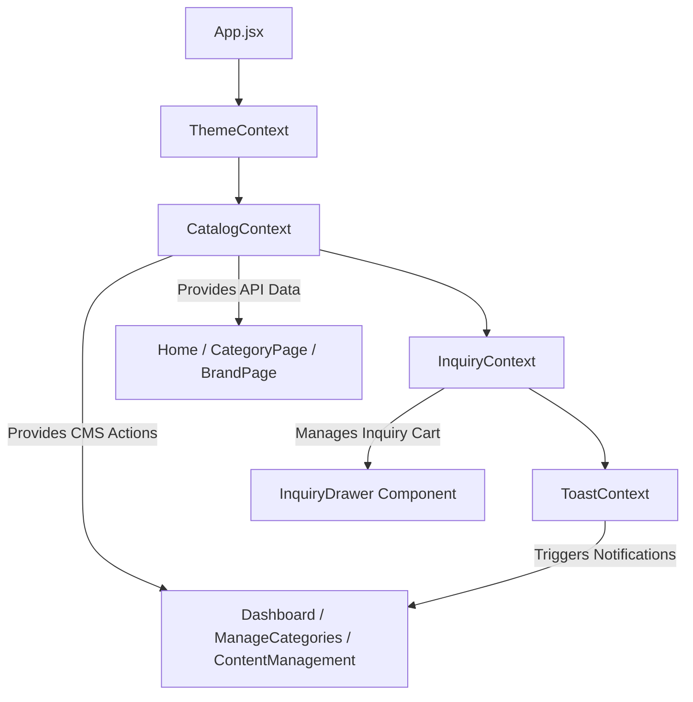
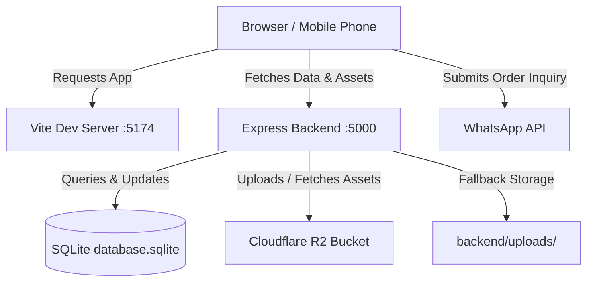

# Comprehensive Technical Documentation: Nauman Sanitary Store

---

## STEP 1: PROJECT STRUCTURE

### Overview
* **Project Name**: `nauman_sanitary` (Nauman Sanitary Store)
* **Project Purpose**: High-performance e-commerce catalog, digital showcase, and admin content management platform for Lahore's Nauman Sanitary Store (sanitary ware, ceramics, faucets, vanities, pipes, and fittings). Features a dynamic product catalog, interactive inquiry cart (WhatsApp integration), theme switching (dark/light), custom cursor, responsive product galleries, and a comprehensive full-stack Admin Portal for product and homepage content management.
* **Overall Architecture**: Decoupled Client-Server SPA Architecture.
  * **Frontend**: React 19 Single Page Application (SPA) built with Vite, React Router DOM v7, Tailwind CSS v4, and vanilla CSS variable design tokens.
  * **Backend**: Node.js Express.js REST API server connected to a local SQLite database with Cloudflare R2 cloud storage integration for product and brand media assets.
* **Monorepo / Workspace Status**: Single repository containing a root React frontend project and an embedded Node.js backend workspace in [`backend/`](file:///s:/nauman_sanitary/backend).

---

### Key Directories & Files Tree

```text
nauman_sanitary/
├── backend/                              # Express.js REST API Backend Server
│   ├── uploads/                          # Local disk storage fallback for uploaded images
│   ├── .env                              # Environment configuration (Cloudflare R2 keys, ports)
│   ├── .env.example                      # Template for backend environment variables
│   ├── cloudflareR2.js                   # Cloudflare R2 S3 SDK client & asset stream proxy
│   ├── database.js                       # SQLite3 database connection, schema & auto-seed
│   ├── database.sqlite                   # SQLite database storage file
│   ├── migrate.js                        # Data migration helper script
│   ├── migrate_to_r2.js                  # Cloudflare R2 automated asset migration script
│   ├── package.json                      # Backend dependencies & package scripts
│   ├── r2_migration_mapping.json         # Mapping cache for local to R2 URL migration
│   ├── seed.js                           # Fallback database seeder script
│   └── server.js                         # Main Express API entry point & routes
├── public/                               # Public static assets (favicon, images, logo)
│   ├── porta-logo.webp                   # Brand logos & fallback product assets
│   ├── website-new-logo.png              # Primary website branding logo
│   └── ...
├── src/                                  # React 19 Frontend Application Root
│   ├── admin/                            # Admin Portal Sub-Application
│   │   ├── layouts/
│   │   │   └── AdminLayout.jsx           # Admin sidebar, header & layout shell
│   │   └── pages/
│   │       ├── ContentManagement.jsx     # CMS for Brands, Hero, Ticker, Stats, Contact
│   │       ├── Dashboard.jsx             # Admin analytics dashboard & metrics overview
│   │       ├── Login.jsx                 # Admin login placeholder page
│   │       └── ManageCategories.jsx      # Product CRUD, multi-image gallery & category filter
│   ├── components/                       # Shared Frontend Components
│   │   ├── sections/                     # Homepage Modular Sections
│   │   │   ├── AllCategoriesSection.jsx  # Grid displaying all product categories
│   │   │   ├── BrandShowcase.jsx         # Tabbed brand showcase section
│   │   │   ├── BrandsStrip.jsx           # Partner brand logos marquee/strip
│   │   │   ├── CategoriesSection.jsx     # Hero categories collection grid
│   │   │   ├── ContactSection.jsx        # Store location, hours & contact info
│   │   │   ├── FeaturedProducts.jsx      # Popular Pick category highlights
│   │   │   ├── HeroSection.jsx           # Main video hero with dynamic water drop effects
│   │   │   ├── LegacySection.jsx         # Store history & value proposition section
│   │   │   ├── StatsSection.jsx          # Live business statistics counters
│   │   │   ├── TickerSection.jsx         # Top scrolling announcement banner
│   │   │   └── WhyUsSection.jsx          # Key selling points grid
│   │   ├── Cursor.jsx                    # Custom animated glowing cursor follower
│   │   ├── Footer.jsx                    # Site footer with brand info & quick links
│   │   ├── InquiryDrawer.css             # Drawer animation & modal styles
│   │   ├── InquiryDrawer.jsx             # Sliding Inquiry Cart drawer with WhatsApp checkout
│   │   ├── Navbar.jsx                    # Header navigation bar & mobile drawer
│   │   └── ProductCard.jsx               # Product card with image carousel & tilt effects
│   ├── constants/
│   │   └── productImages.js              # Fallback category image mappings
│   ├── context/                          # React Context Providers
│   │   ├── CatalogContext.jsx            # Global catalog state & API data synchronization
│   │   ├── InquiryContext.jsx            # Inquiry cart state & localStorage persistence
│   │   ├── ThemeContext.jsx              # Light/Dark mode state manager
│   │   └── ToastContext.jsx              # Global notification toast system
│   ├── data/
│   │   └── categories.js                 # Fallback catalog dataset & image resolver rules
│   ├── hooks/
│   │   └── useScrollReveal.js            # Intersection Observer scroll animation hook
│   ├── utils/
│   │   ├── apiConfig.js                  # Dynamic API base URL & R2 image path resolver
│   │   └── brandUtils.js                 # Brand name normalization utilities
│   ├── App.jsx                           # Application router & provider wrapper
│   ├── index.css                         # CSS design system (tokens, keyframes, responsive rules)
│   └── main.jsx                          # React 19 application entry point
├── eslint.config.js                      # ESLint configuration
├── index.html                            # HTML5 root template
├── package.json                          # Frontend dependencies & Vite scripts
├── README.md                             # Project documentation
├── RESPONSIVENESS_AND_ROUTES_GUIDE.md    # Layout & responsive design reference
└── vite.config.js                        # Vite build configuration & dev proxy
```

---

## STEP 2: TECHNOLOGY STACK

### Frontend
* **Language**: JavaScript (ES6+ / React JSX)
* **Framework**: React 19 (`react` `^19.2.6`, `react-dom` `^19.2.6`)
  * *Why*: Provides high performance UI rendering, declarative component tree composition, and seamless context-driven state management.
* **Build Tool & Dev Server**: Vite (`vite` `^8.0.12`, `@vitejs/plugin-react` `^6.0.1`)
  * *Why*: Instant Server Start, fast HMR (Hot Module Replacement), and efficient ESbuild/Rollup bundling.
* **Routing**: React Router DOM v7 (`react-router-dom` `^7.16.0`)
  * *Why*: Handles nested route layouts ([`PublicLayout`](file:///s:/nauman_sanitary/src/App.jsx#L32), [`AdminLayout`](file:///s:/nauman_sanitary/src/admin/layouts/AdminLayout.jsx#L5)), dynamic URL parameters (`/category/:slug`, `/brand/:brandName`), and programmatic navigation.
* **Styling & Design System**: 
  * Vanilla CSS (`src/index.css`) with custom CSS variables (`--bg`, `--ivory`, `--bronze`, `--ink`, etc.), custom animations (`waterDrop`, `tickerScroll`), and responsive media queries.
  * Tailwind CSS v4 (`tailwindcss` `^4.3.0`, `@tailwindcss/vite` `^4.3.0`).
  * Utility Libraries: `clsx` (`^2.1.1`), `tailwind-merge` (`^3.6.0`).
* **Icons**: Lucide React (`lucide-react` `^1.28.0`)
  * *Why*: Provides scalable SVG icons for admin dashboard metrics and UI controls.
* **State Management**:
  * React Context API ([`CatalogContext`](file:///s:/nauman_sanitary/src/context/CatalogContext.jsx#L15), [`InquiryContext`](file:///s:/nauman_sanitary/src/context/InquiryContext.jsx#L12), [`ThemeContext`](file:///s:/nauman_sanitary/src/context/ThemeContext.jsx#L6), [`ToastContext`](file:///s:/nauman_sanitary/src/context/ToastContext.jsx#L6)).
  * Local component state (`useState`, `useMemo`, `useRef`, `useEffect`).

---

### Backend
* **Language / Environment**: Node.js (CommonJS modules)
* **Framework**: Express.js (`express` `^5.2.1`)
  * *Why*: Lightweight, flexible HTTP server to handle CMS REST endpoints and upload proxying.
* **File Uploads**: Multer (`multer` `^2.2.0`)
  * *Why*: Handles multipart form data buffer parsing for product and brand image uploads.
* **Middleware**: `compression` (`^1.8.2`), `cors` (`^2.8.6`), `body-parser` (`^2.3.0`), `express.static`.
* **Automation & Utilities**: Puppeteer (`puppeteer` `^25.5.0` - used for screenshot generation scripts), `dotenv` (`^18.0.4`).

---

### Database
* **Database Engine**: SQLite3 (`sqlite3` `^6.0.1`)
* **Mode**: Single-file relational database operating in Write-Ahead Logging mode (`PRAGMA journal_mode = WAL`, `PRAGMA synchronous = NORMAL`).
* **Query Mechanism**: Native SQLite parameterised statements (`db.all`, `db.get`, `db.run`, `db.prepare`) in [`backend/database.js`](file:///s:/nauman_sanitary/backend/database.js#L16).

---

### Infrastructure & Cloud Storage
* **Cloud Object Storage**: Cloudflare R2 Object Storage accessed via AWS S3 Client SDK (`@aws-sdk/client-s3` `^3.1141.0`).
* **Storage Strategy**: Hybrid Cloud Storage. Images are uploaded directly to Cloudflare R2 bucket when credentials are present; if offline or unconfigured, the system automatically falls back to local disk storage in [`backend/uploads/`](file:///s:/nauman_sanitary/backend/uploads).
* **Reverse Proxy / Local Proxy**: Vite Dev Proxy configured in [`vite.config.js`](file:///s:/nauman_sanitary/vite.config.js#L17-L25) routes `/api` and `/uploads` requests from port 5174 to backend port 5000.

---

## STEP 3: FRONTEND DEEP ANALYSIS

### Application Entry Point
The application starts at [`src/main.jsx`](file:///s:/nauman_sanitary/src/main.jsx#L1):
```jsx
import { StrictMode } from 'react'
import { createRoot } from 'react-dom/client'
import './index.css'
import App from './App.jsx'

createRoot(document.getElementById('root')).render(
  <StrictMode>
    <App />
  </StrictMode>,
)
```
It attaches to `<div id="root"></div>` in [`index.html`](file:///s:/nauman_sanitary/index.html#L38) and loads global design tokens from [`src/index.css`](file:///s:/nauman_sanitary/src/index.css#L1).

---

### Router & Routes Structure
Configured in [`src/App.jsx`](file:///s:/nauman_sanitary/src/App.jsx#L52-L74):

| Route Path | Route Type | Component | Description |
| :--- | :--- | :--- | :--- |
| `/` | Public | [`Home`](file:///s:/nauman_sanitary/src/pages/Home.jsx#L14) | Landing page with Hero, Categories, Brands, Products, Stats, and Contact |
| `/category/:slug` | Public | [`CategoryPage`](file:///s:/nauman_sanitary/src/pages/CategoryPage.jsx#L164) | Category page with brand filtering, subcategories, grid & pagination |
| `/brand/:brandName` | Public | [`BrandPage`](file:///s:/nauman_sanitary/src/pages/BrandPage.jsx#L22) | Brand page showcasing products filtered by manufacturer |
| `*` | Public | `NotFound` | 404 page |
| `/admin/login` | Admin | [`Login`](file:///s:/nauman_sanitary/src/admin/pages/Login.jsx#L1) | Admin authentication placeholder |
| `/admin` | Admin | [`Dashboard`](file:///s:/nauman_sanitary/src/admin/pages/Dashboard.jsx#L5) | Overview metrics, quick action links, category breakdown |
| `/admin/categories` | Admin | [`ManageCategories`](file:///s:/nauman_sanitary/src/admin/pages/ManageCategories.jsx#L17) | Product management (CRUD, multi-image upload, search, filters) |
| `/admin/hero` | Admin | [`ContentManagement`](file:///s:/nauman_sanitary/src/admin/pages/ContentManagement.jsx#L14) | Manage Homepage Hero Collections |
| `/admin/brands` | Admin | [`ContentManagement`](file:///s:/nauman_sanitary/src/admin/pages/ContentManagement.jsx#L14) | Manage Partner Brand Logos |
| `/admin/ticker` | Admin | [`ContentManagement`](file:///s:/nauman_sanitary/src/admin/pages/ContentManagement.jsx#L14) | Manage Announcement Ticker messages |
| `/admin/stats` | Admin | [`ContentManagement`](file:///s:/nauman_sanitary/src/admin/pages/ContentManagement.jsx#L14) | Manage Business Counter Statistics |
| `/admin/contact` | Admin | [`ContentManagement`](file:///s:/nauman_sanitary/src/admin/pages/ContentManagement.jsx#L14) | Manage Store Contact Details & WhatsApp |

---

### Core Frontend Components

#### 1. [`Navbar.jsx`](file:///s:/nauman_sanitary/src/components/Navbar.jsx#L27)
* **Purpose**: Sticky header navigation bar with desktop dropdown menus, mobile navigation drawer, and inquiry cart counter button.
* **Key State**: `solid` (scrolled header state), `open` (mobile menu toggle), `activeMobileTab`, `activeMobileBrand`.
* **Dependencies**: `useCatalog`, `useInquiry`, `useTheme`, `react-router-dom`.

#### 2. [`ProductCard.jsx`](file:///s:/nauman_sanitary/src/components/ProductCard.jsx#L4)
* **Purpose**: Product card supporting multi-image horizontal touch slider, brand color tags, image fallback handling via [`formatImgUrl`](file:///s:/nauman_sanitary/src/utils/apiConfig.js#L11), and inquiry cart integration.
* **Props**: `prod`, `slug`, `handleEnquire`, `CONTACT`, `BRAND_COLORS`, `PROD_IMAGES`, `normalizeBrand`.
* **State**: `imgIdx` (active carousel index), `isExpanded` (accordion details toggle).

#### 3. [`InquiryDrawer.jsx`](file:///s:/nauman_sanitary/src/components/InquiryDrawer.jsx#L10)
* **Purpose**: Sliding inquiry cart drawer allowing users to review selected sanitary products, adjust quantities, fill customer contact details, and send formatted inquiry orders directly to WhatsApp.
* **Dependencies**: `useInquiry`, `useCatalog`.

#### 4. [`HeroSection.jsx`](file:///s:/nauman_sanitary/src/components/sections/HeroSection.jsx#L14)
* **Purpose**: Video background hero with canvas particle water drop animations.

---

### State Management Architecture



1. **[`CatalogContext`](file:///s:/nauman_sanitary/src/context/CatalogContext.jsx#L15)**: Fetches initial store data from backend endpoints (`/api/categories`, `/api/hero`, `/api/contact`, `/api/ticker`, `/api/stats`, `/api/brands`) and provides optimistic state updates for product CRUD operations.
2. **[`InquiryContext`](file:///s:/nauman_sanitary/src/context/InquiryContext.jsx#L12)**: Manages items in the user's inquiry cart and persists state to `localStorage` under `nauman_inquiry_cart`.
3. **[`ThemeContext`](file:///s:/nauman_sanitary/src/context/ThemeContext.jsx#L6)**: Toggles dark/light visual mode, setting `data-theme` attribute on `document.documentElement` and storing preference under `nss-theme`.
4. **[`ToastContext`](file:///s:/nauman_sanitary/src/context/ToastContext.jsx#L6)**: Renders notification popups (success, error) for admin actions.

---

## STEP 4: BACKEND DEEP ANALYSIS

### Entry Point & Middleware Chain
Defined in [`backend/server.js`](file:///s:/nauman_sanitary/backend/server.js#L1):
1. Loads environment variables via `dotenv.config()`.
2. Instantiates Express app with `compression()`, `cors()`, `express.json()`.
3. Registers image streaming proxy routes for R2 assets (`/uploads/:filename`, `/r2-media/*`).
4. Mounts static directory fallback (`/uploads`).
5. Defines API route endpoints for CMS and product operations.

---

### Backend API Endpoints Reference Table

| Method | Endpoint | Purpose | Auth | Request Body | Response | Source File |
| :--- | :--- | :--- | :--- | :--- | :--- | :--- |
| `GET` | `/api/categories` | Retrieve all categories with products | None | None | `Array<Category>` | [`server.js:276`](file:///s:/nauman_sanitary/backend/server.js#L276) |
| `POST` | `/api/products` | Create a new product | None | `ProductJSON` | `{ success: true }` | [`server.js:297`](file:///s:/nauman_sanitary/backend/server.js#L297) |
| `PUT` | `/api/products/:id` | Update product details/images | None | `ProductJSON` | `{ success: true }` | [`server.js:314`](file:///s:/nauman_sanitary/backend/server.js#L314) |
| `DELETE` | `/api/products/:id` | Delete product by ID | None | None | `{ success: true }` | [`server.js:330`](file:///s:/nauman_sanitary/backend/server.js#L330) |
| `POST` | `/api/products/delete-bulk` | Delete multiple products by ID array | None | `{ ids: Array<string> }` | `{ success: true }` | [`server.js:337`](file:///s:/nauman_sanitary/backend/server.js#L337) |
| `POST` | `/api/upload` | Upload image file (R2 or Local) | None | `multipart/form-data` | `{ url: string, storage: string }` | [`server.js:95`](file:///s:/nauman_sanitary/backend/server.js#L95) |
| `GET` | `/api/hero` | Retrieve homepage hero collection cards | None | None | `Array<Hero>` | [`server.js:138`](file:///s:/nauman_sanitary/backend/server.js#L138) |
| `POST` | `/api/hero` | Create hero category card | None | `{ title, subtitle, img, slug }` | `HeroObject` | [`server.js:144`](file:///s:/nauman_sanitary/backend/server.js#L144) |
| `PUT` | `/api/hero/:id` | Update hero category card | None | `{ title, subtitle, img, slug }` | `{ success: true }` | [`server.js:151`](file:///s:/nauman_sanitary/backend/server.js#L151) |
| `DELETE` | `/api/hero/:id` | Delete hero category card | None | None | `{ success: true }` | [`server.js:161`](file:///s:/nauman_sanitary/backend/server.js#L161) |
| `GET` | `/api/brands` | Retrieve brand logos list | None | None | `Array<Brand>` | [`server.js:169`](file:///s:/nauman_sanitary/backend/server.js#L169) |
| `POST` | `/api/brands` | Create brand entry | None | `{ name, logo }` | `BrandObject` | [`server.js:175`](file:///s:/nauman_sanitary/backend/server.js#L175) |
| `PUT` | `/api/brands/:id` | Update brand entry | None | `{ name, logo }` | `{ success: true }` | [`server.js:182`](file:///s:/nauman_sanitary/backend/server.js#L182) |
| `DELETE` | `/api/brands/:id` | Delete brand entry | None | None | `{ success: true }` | [`server.js:189`](file:///s:/nauman_sanitary/backend/server.js#L189) |
| `GET` | `/api/stats` | Retrieve store stats counters | None | None | `Array<Stat>` | [`server.js:197`](file:///s:/nauman_sanitary/backend/server.js#L197) |
| `POST` | `/api/stats` | Create store stat counter | None | `{ value, label }` | `StatObject` | [`server.js:203`](file:///s:/nauman_sanitary/backend/server.js#L203) |
| `PUT` | `/api/stats/:id` | Update store stat counter | None | `{ value, label }` | `{ success: true }` | [`server.js:210`](file:///s:/nauman_sanitary/backend/server.js#L210) |
| `DELETE` | `/api/stats/:id` | Delete store stat counter | None | None | `{ success: true }` | [`server.js:217`](file:///s:/nauman_sanitary/backend/server.js#L217) |
| `GET` | `/api/ticker` | Retrieve announcement ticker messages | None | None | `Array<Ticker>` | [`server.js:225`](file:///s:/nauman_sanitary/backend/server.js#L225) |
| `POST` | `/api/ticker` | Add ticker message | None | `{ message }` | `TickerObject` | [`server.js:231`](file:///s:/nauman_sanitary/backend/server.js#L231) |
| `PUT` | `/api/ticker/:id` | Update ticker message | None | `{ message }` | `{ success: true }` | [`server.js:238`](file:///s:/nauman_sanitary/backend/server.js#L238) |
| `DELETE` | `/api/ticker/:id` | Delete ticker message | None | None | `{ success: true }` | [`server.js:245`](file:///s:/nauman_sanitary/backend/server.js#L245) |
| `GET` | `/api/contact` | Retrieve contact details | None | None | `ContactObject` | [`server.js:253`](file:///s:/nauman_sanitary/backend/server.js#L253) |
| `POST` | `/api/contact` | Update contact details | None | `ContactObject` | `ContactObject` | [`server.js:259`](file:///s:/nauman_sanitary/backend/server.js#L259) |
| `GET` | `/api/cloudflare/status` | Check Cloudflare R2 connectivity | None | None | `R2StatusJSON` | [`server.js:85`](file:///s:/nauman_sanitary/backend/server.js#L85) |

---

## STEP 5: DATABASE DEEP ANALYSIS

### Database Entity Relationship (ER) Diagram

```mermaid
erDiagram
    CATEGORIES ||--o{ PRODUCTS : contains
    
    CATEGORIES {
        INTEGER id PK
        TEXT slug UNIQUE
        TEXT no
        TEXT name
        TEXT hint
        TEXT icon
    }
    
    PRODUCTS {
        TEXT id PK
        INTEGER categoryId FK
        TEXT name
        TEXT brand
        REAL price
        INTEGER stock
        TEXT code
        TEXT color
        TEXT image
        TEXT images
        TEXT description
    }
    
    BRANDS {
        INTEGER id PK
        TEXT name
        TEXT logo
    }

    HERO {
        INTEGER id PK
        TEXT title
        TEXT subtitle
        TEXT img
        TEXT slug
    }

    CONTACT {
        INTEGER id PK
        TEXT owner
        TEXT phone
        TEXT phoneFormatted
        TEXT whatsappUrl
    }

    TICKER {
        INTEGER id PK
        TEXT message
    }

    STATS {
        INTEGER id PK
        TEXT value
        TEXT label
    }
```

---

### Database Schema Table Definitions

#### 1. Table `categories`
* **Primary Key**: `id` (INTEGER AUTOINCREMENT)
* **Fields**:
  * `slug`: TEXT UNIQUE NOT NULL (e.g. `'toilets'`, `'basins'`)
  * `no`: TEXT (e.g. `'01'`, `'02'`)
  * `name`: TEXT NOT NULL (e.g. `'Commodes & Toilets'`)
  * `hint`: TEXT (e.g. `'One Piece · Wall Hung · Cisterns'`)
  * `icon`: TEXT (e.g. `'🚽'`)
* **Indexes**: `idx_categories_slug` on `categories(slug)`.

#### 2. Table `products`
* **Primary Key**: `id` (TEXT PRIMARY KEY)
* **Foreign Key**: `categoryId` REFERENCES `categories(id)` ON DELETE CASCADE
* **Fields**:
  * `name`: TEXT NOT NULL
  * `brand`: TEXT NOT NULL (e.g. `'Porta'`, `'Master'`, `'Pool'`)
  * `price`: REAL
  * `stock`: INTEGER
  * `code`: TEXT
  * `color`: TEXT
  * `image`: TEXT (Primary image URL)
  * `images`: TEXT (JSON stringified array of gallery image URLs)
  * `description`: TEXT
* **Indexes**: `idx_products_category` on `products(categoryId)`, `idx_products_brand` on `products(brand)`.

---

## STEP 6: AUTHENTICATION AND AUTHORIZATION

* **Status**: `Partially Implemented` / `Development Template`.
* **Frontend Component**: [`Login.jsx`](file:///s:/nauman_sanitary/src/admin/pages/Login.jsx#L1) currently renders a simple placeholder `<div>Login</div>`.
* **Backend Enforcements**: The Express backend endpoints in [`backend/server.js`](file:///s:/nauman_sanitary/backend/server.js#L138-L347) currently serve public administrative endpoints without active JWT or session middleware.
* **Protected Routes**: `/admin` routes are defined under [`AdminLayout`](file:///s:/nauman_sanitary/src/admin/layouts/AdminLayout.jsx#L5) in [`App.jsx`](file:///s:/nauman_sanitary/src/App.jsx#L64).

---

## STEP 7: AI / LLM ANALYSIS

* **Status**: `Not Found`.
* **Details**: Inspection of dependency manifests ([`package.json`](file:///s:/nauman_sanitary/package.json#L12-L33), [`backend/package.json`](file:///s:/nauman_sanitary/backend/package.json#L13-L23)) and source directories confirms no AI/LLM frameworks (e.g., OpenAI SDK, LangChain, vector databases, or prompt engines) exist in this project.

---

## STEP 8: EXTERNAL SERVICES AND INTEGRATIONS

### 1. Cloudflare R2 Object Storage
* **Purpose**: Cloud asset storage for uploaded product and brand images.
* **Configuration**: Credentials configured in [`backend/.env`](file:///s:/nauman_sanitary/backend/.env.example#L1-L10).
* **Implementation**: Integrated via `@aws-sdk/client-s3` in [`backend/cloudflareR2.js`](file:///s:/nauman_sanitary/backend/cloudflareR2.js#L5-L152).
* **Streaming Proxy Route**: `GET /uploads/:filename` and `GET /r2-media/*` in [`backend/server.js:24-73`](file:///s:/nauman_sanitary/backend/server.js#L24-L73) stream objects directly from R2 to the browser with fallbacks.

### 2. WhatsApp Click-to-Chat Integration
* **Purpose**: Direct customer checkout and inquiry submission.
* **Implementation**: Formats order items from [`InquiryDrawer.jsx`](file:///s:/nauman_sanitary/src/components/InquiryDrawer.jsx#L40-L65) into a pre-filled WhatsApp message URL targeting `CONTACT.whatsappUrl`.

---

## STEP 9: ENVIRONMENT VARIABLES

| Variable Name | Purpose | Used By | Required | Format / Example |
| :--- | :--- | :--- | :--- | :--- |
| `CLOUDFLARE_API_TOKEN` | Cloudflare API Token for R2 management | [`backend/cloudflareR2.js`](file:///s:/nauman_sanitary/backend/cloudflareR2.js#L116) | Optional | `Configured secret, value intentionally hidden` |
| `CLOUDFLARE_R2_ACCESS_KEY_ID` | R2 S3 Access Key ID | [`backend/cloudflareR2.js`](file:///s:/nauman_sanitary/backend/cloudflareR2.js#L7) | Optional | `Configured secret, value intentionally hidden` |
| `CLOUDFLARE_R2_SECRET_ACCESS_KEY` | R2 S3 Secret Access Key | [`backend/cloudflareR2.js`](file:///s:/nauman_sanitary/backend/cloudflareR2.js#L8) | Optional | `Configured secret, value intentionally hidden` |
| `CLOUDFLARE_ACCOUNT_ID` | Cloudflare Account ID for endpoint construction | [`backend/cloudflareR2.js`](file:///s:/nauman_sanitary/backend/cloudflareR2.js#L6) | Optional | `Configured secret, value intentionally hidden` |
| `CLOUDFLARE_R2_BUCKET_NAME` | Name of Cloudflare R2 Storage Bucket | [`backend/cloudflareR2.js`](file:///s:/nauman_sanitary/backend/cloudflareR2.js#L42) | Optional | `nauman-sanitary-uploads` |
| `CLOUDFLARE_R2_PUBLIC_URL` | Optional custom CDN domain for R2 assets | [`backend/cloudflareR2.js`](file:///s:/nauman_sanitary/backend/cloudflareR2.js#L61) | Optional | `https://pub-xxxx.r2.dev` |

---

## STEP 10: COMPLETE APPLICATION FLOWS

### 1. User Product Browsing & Filtering Flow

```text
User opens Website (http://localhost:5174/)
   ↓
App initializes CatalogProvider & fetches /api/categories
   ↓
User selects a category (e.g. "/category/toilets")
   ↓
CategoryPage matches category slug & retrieves category products
   ↓
User clicks Brand Filter pill or Subcategory pill
   ↓
CategoryPage computes filtered list via useMemo()
   ↓
ProductCard renders product image carousel (using formatImgUrl for IP resolution)
```

---

### 2. Inquiry Cart & WhatsApp Checkout Flow

```text
User clicks "Add to Inquiry Cart" on ProductCard
   ↓
Product item passed to InquiryContext (addToInquiry)
   ↓
Cart updated in React state and stored in localStorage ("nauman_inquiry_cart")
   ↓
User opens InquiryDrawer and enters name, phone & address
   ↓
User clicks "Send Inquiry via WhatsApp"
   ↓
Drawer formats text message string with products, quantities & total count
   ↓
Redirects window to https://wa.me/<phone>?text=<encoded_inquiry_details>
```

---

### 3. Admin Product Creation & Image Upload Flow

```text
Admin accesses /admin/categories
   ↓
Fills product details and selects image file(s)
   ↓
ManageCategories submits FormData to POST /api/upload
   ↓
Backend server attempts Cloudflare R2 upload (falls back to local disk in backend/uploads/)
   ↓
Returns clean relative image URL ("/uploads/17278783783-item.jpg")
   ↓
ManageCategories calls addProduct() -> POST /api/products
   ↓
Backend inserts product into SQLite database
   ↓
CatalogContext receives confirmation & updates categories state optimistically
```

---

## STEP 11: API COMMUNICATION FLOW

```text
React Component (e.g. ManageCategories.jsx)
      ↓
API Helper / fetch (${API_BASE}/products)
      ↓
HTTP POST Request over Vite Proxy (Port 5174 -> 5000)
      ↓
Express Route Listener (app.post('/api/products'))
      ↓
JSON Middleware Parsing
      ↓
SQLite Database Driver (db.run INSERT INTO products...)
      ↓
Database writes record to database.sqlite
      ↓
Express returns JSON Response ({ success: true })
      ↓
CatalogContext updates React state
      ↓
UI updates dynamically without page reload
```

---

## STEP 12: ERROR HANDLING

* **Frontend Network Fallbacks**: In [`CatalogContext.jsx:50`](file:///s:/nauman_sanitary/src/context/CatalogContext.jsx#L50), if backend API fetches fail (e.g., server offline), the context logs a warning and gracefully falls back to static dataset [`ALL_CATEGORIES`](file:///s:/nauman_sanitary/src/data/categories.js#L1).
* **Image Loading Fallbacks**: `ProductCard.jsx` handles image load errors (`onError`) by substituting missing images with category fallback icons or `/prod-commode.png`.
* **Backend Storage Fallbacks**: In [`backend/server.js:114`](file:///s:/nauman_sanitary/backend/server.js#L114) and [`cloudflareR2.js:110`](file:///s:/nauman_sanitary/backend/cloudflareR2.js#L110), if R2 bucket uploads fail, Multer buffers are saved to local disk ([`backend/uploads/`](file:///s:/nauman_sanitary/backend/uploads)).

---

## STEP 13: SECURITY IMPLEMENTATION AUDIT

* **CORS**: `Implemented` via `cors()` middleware in [`backend/server.js:13`](file:///s:/nauman_sanitary/backend/server.js#L13).
* **SQL Injection Protection**: `Implemented` via parameterised SQLite queries (`?` placeholders) across all SQL statements in [`backend/server.js`](file:///s:/nauman_sanitary/backend/server.js#L146-L343) and [`backend/database.js`](file:///s:/nauman_sanitary/backend/database.js#L64).
* **Compression**: `Implemented` via `compression()` middleware in [`backend/server.js:12`](file:///s:/nauman_sanitary/backend/server.js#L12).
* **Secrets Management**: `Implemented` via `.env` environment configuration ignored in `.gitignore`.
* **Authentication Middleware**: `Not Found` / `Needs Implementation`.

---

## STEP 14: PERFORMANCE OPTIMIZATION

* **Database Indexing**: Indexes created on `products(categoryId)`, `products(brand)`, and `categories(slug)` in [`backend/database.js:18-20`](file:///s:/nauman_sanitary/backend/database.js#L18-L20).
* **SQLite WAL Mode**: Operating in Write-Ahead Logging mode (`PRAGMA journal_mode = WAL`) for concurrent read/write performance.
* **Image Lazy Loading**: Product cards and categories use native HTML5 `loading="lazy"` and `decoding="async"`.
* **CSS Variable Design System**: High performance CSS execution without utility class overhead.

---

## STEP 15: TESTING

* **Test Framework**: `Not Found`.
* **Test Files**: `Not Found`.
* **Test Scripts**: [`package.json`](file:///s:/nauman_sanitary/package.json#L9) contains standard `npm run lint`. [`backend/package.json`](file:///s:/nauman_sanitary/backend/package.json#L7) contains a placeholder test script.

---

## STEP 16: BUILD AND DEPLOYMENT

### Development Setup

1. **Install Dependencies**:
   ```bash
   # Root frontend dependencies
   npm install

   # Backend dependencies
   cd backend
   npm install
   ```

2. **Run Backend API Server**:
   ```bash
   cd backend
   node server.js
   ```

3. **Run Frontend Application**:
   ```bash
   npm run dev
   ```

4. **Production Build**:
   ```bash
   npm run build
   ```

---

## STEP 17: DEPENDENCY ANALYSIS SUMMARY

### Frontend Dependencies ([`package.json`](file:///s:/nauman_sanitary/package.json#L12-L33))
* `react` (`^19.2.6`), `react-dom` (`^19.2.6`)
* `react-router-dom` (`^7.16.0`)
* `lucide-react` (`^1.28.0`)
* `clsx` (`^2.1.1`), `tailwind-merge` (`^3.6.0`), `tailwindcss` (`^4.3.0`), `@tailwindcss/vite` (`^4.3.0`)
* `vite` (`^8.0.12`), `@vitejs/plugin-react` (`^6.0.1`)

### Backend Dependencies ([`backend/package.json`](file:///s:/nauman_sanitary/backend/package.json#L13-L23))
* `express` (`^5.2.1`)
* `sqlite3` (`^6.0.1`)
* `@aws-sdk/client-s3` (`^3.1141.0`)
* `multer` (`^2.2.0`)
* `compression` (`^1.8.2`), `cors` (`^2.8.6`), `body-parser` (`^2.3.0`)
* `dotenv` (`^18.0.4`)

---

## STEP 18: IMPORTANT FILES TO UNDERSTAND

1. **[`backend/server.js`](file:///s:/nauman_sanitary/backend/server.js#L1)**: Express backend server managing SQLite data access and Cloudflare R2 proxy endpoints.
2. **[`src/context/CatalogContext.jsx`](file:///s:/nauman_sanitary/src/context/CatalogContext.jsx#L15)**: Central React Context bridging frontend state with backend REST endpoints.
3. **[`src/components/ProductCard.jsx`](file:///s:/nauman_sanitary/src/components/ProductCard.jsx#L4)**: Core product display component featuring image sliders and cart integration.
4. **[`src/admin/pages/ManageCategories.jsx`](file:///s:/nauman_sanitary/src/admin/pages/ManageCategories.jsx#L17)**: Full-featured Product CMS page in the Admin Portal.
5. **[`src/utils/apiConfig.js`](file:///s:/nauman_sanitary/src/utils/apiConfig.js#L1)**: Cross-device host and upload URL resolution helper.
6. **[`src/index.css`](file:///s:/nauman_sanitary/src/index.css#L1)**: Central styling sheet containing theme tokens, keyframe animations, and layout responsive rules.

---

## STEP 19: BEGINNER LEARNING PATH

1. **Architecture Overview**: Read [`README.md`](file:///s:/nauman_sanitary/README.md) and [`src/App.jsx`](file:///s:/nauman_sanitary/src/App.jsx#L1).
2. **State & Data Flow**: Inspect [`src/context/CatalogContext.jsx`](file:///s:/nauman_sanitary/src/context/CatalogContext.jsx#L15) and [`src/utils/apiConfig.js`](file:///s:/nauman_sanitary/src/utils/apiConfig.js#L1).
3. **Public Interface**: Read [`src/pages/Home.jsx`](file:///s:/nauman_sanitary/src/pages/Home.jsx#L14), [`src/pages/CategoryPage.jsx`](file:///s:/nauman_sanitary/src/pages/CategoryPage.jsx#L164), and [`src/components/ProductCard.jsx`](file:///s:/nauman_sanitary/src/components/ProductCard.jsx#L4).
4. **Inquiry Cart**: Inspect [`src/context/InquiryContext.jsx`](file:///s:/nauman_sanitary/src/context/InquiryContext.jsx#L12) and [`src/components/InquiryDrawer.jsx`](file:///s:/nauman_sanitary/src/components/InquiryDrawer.jsx#L10).
5. **Admin Portal**: Inspect [`src/admin/layouts/AdminLayout.jsx`](file:///s:/nauman_sanitary/src/admin/layouts/AdminLayout.jsx#L5) and [`src/admin/pages/ManageCategories.jsx`](file:///s:/nauman_sanitary/src/admin/pages/ManageCategories.jsx#L17).
6. **Backend Server & Database**: Read [`backend/server.js`](file:///s:/nauman_sanitary/backend/server.js#L1), [`backend/database.js`](file:///s:/nauman_sanitary/backend/database.js#L16), and [`backend/cloudflareR2.js`](file:///s:/nauman_sanitary/backend/cloudflareR2.js#L5).

---

## STEP 20: "HOW EVERYTHING CONNECTS"



When a user opens the website, React renders the application inside the browser. `CatalogContext` fires an initial request to `http://<host>:5000/api/categories`. Express retrieves categories and products from `database.sqlite`, formatting image paths through `formatImgUrl()`. When an admin uploads a product photo, Express routes the file to Cloudflare R2 (or local storage), updates SQLite, and `CatalogContext` updates the live UI instantly. When a customer adds items to their inquiry cart and submits, the app constructs a formatted WhatsApp inquiry link and opens WhatsApp directly.

---

## STEP 21: GLOSSARY

* **Vite**: Modern frontend build tool providing fast module replacement and bundling.
* **React Context API**: Native React feature used for global state management without external libraries.
* **SQLite WAL Mode**: Write-Ahead Logging setting improving database concurrency and write speed.
* **Cloudflare R2**: Amazon S3-compatible cloud object storage service without egress fees.
* **Inquiry Cart**: E-commerce cart pattern where users send pre-filled order lists directly to sales reps via WhatsApp.

---

## STEP 22: KNOWN ISSUES AND GAPS

### Confirmed Items
* Admin Authentication ([`src/admin/pages/Login.jsx`](file:///s:/nauman_sanitary/src/admin/pages/Login.jsx#L1)) is currently a placeholder component; endpoints do not enforce authorization headers.

### Potential Enhancements
* Implementing automated unit/integration tests for API routes and context state transitions.

---

## STEP 23: FINAL PROJECT CHEAT SHEET

```text
Project: Nauman Sanitary Store
Purpose: E-Commerce Product Catalog, Inquiry Cart & Admin CMS Platform

Frontend:
Language: JavaScript (React 19 JSX)
Framework: React 19 + React Router DOM v7
Build Tool: Vite v8

Backend:
Language: Node.js (CommonJS)
Framework: Express.js v5

Database:
Database: SQLite3 (WAL Mode)
ORM/Query: Native SQLite Statements

Authentication:
Status: Placeholder / Needs Active Auth Middleware Implementation

Cloud Storage:
Provider: Cloudflare R2 (via AWS S3 SDK) + Local Fallback

Main Features:
- Dynamic Product & Category Catalog
- Mobile-Responsive Multi-Image Carousels
- WhatsApp Direct Inquiry Order Checkout
- Admin CMS for Products, Brands, Hero Cards, Stats, Ticker & Contact Info
- Light / Dark Mode System

How to Run:
Backend:  cd backend && node server.js (Port 5000)
Frontend: npm run dev (Port 5174)

Important Files:
- backend/server.js
- src/context/CatalogContext.jsx
- src/components/ProductCard.jsx
- src/admin/pages/ManageCategories.jsx
- src/utils/apiConfig.js
- src/index.css
```
